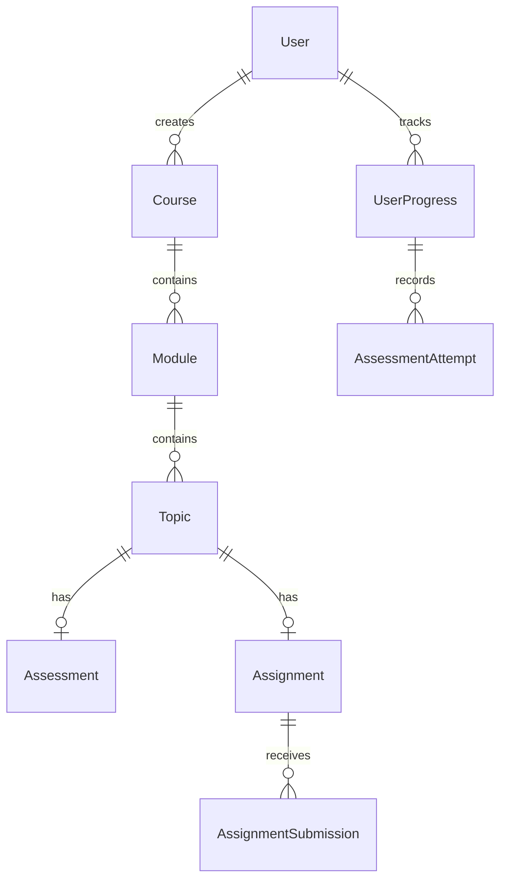

# 🎓 SMART ACADEMIC COMPANION (SAC)

An intelligent, role-based academic management system built with **Next.js 14**, **MongoDB**, and **NextAuth.js**. SAC provides a futuristic, 3D-enhanced interface for students, teachers, and administrators to manage courses, assessments, assignments, and analytics.

---

## ✨ Features

### 🔐 Authentication & Authorization
- **Google OAuth** + **Azure AD** integration for university domains (`@geu.ac.in`)
- **Credentials-based login** for development/testing
- Role-based access control: **Student**, **Teacher**, **Admin**
- Master Portal for admins to switch between all role views

### 👨‍🏫 Teacher System
- **Course Builder** — Create courses with nested modules, topics, quizzes, and assignments
- **Curriculum Editor** — Full CRUD on existing courses (add/edit/delete modules, topics, assessments)
- **Assessment Creator** — Build MCQ quizzes with configurable options and correct answers
- **Assignment System** — Attach assignments with instructions, max scores, and deadlines
- **Live Dashboard** — Real-time stats from MongoDB (active courses, enrolled students, assessments taken)

### 👨‍🎓 Student System
- **Course Enrollment** — Browse and enroll in published courses
- **Interactive Course Viewer** — Split-pane layout with curriculum tree and content viewer
- **Quiz Engine** — Take MCQ assessments with instant scoring and pass/fail feedback
- **Assignment Submission** — Submit text-based assignments directly from the course viewer
- **Progress Tracking** — Real-time completion percentage, topic tracking, and streak indicators
- **Continue Learning** — Dashboard widget shows your most recent course with resume capability
- **Performance Analytics** — Score trajectories, weak area detection, and learning metrics

### 🛡️ Admin System
- **User Management** — View all users, assign roles (student/teacher/admin)
- **System Overview** — Total users, active admins, database health metrics
- **Global Controls** — System-wide moderation capabilities

### 🎨 UI/UX
- **3D WebGL Background** — Ambient particle effects using `@react-three/fiber`
- **Framer Motion Animations** — Staggered entrances, hover effects, smooth transitions
- **Glassmorphism Design** — Dark theme with frosted glass cards, neon accents, and gradients
- **Responsive Layout** — Works across desktop and tablet viewports

---

## 🛠️ Tech Stack

| Layer | Technology |
|-------|-----------|
| **Framework** | Next.js 14 (App Router) |
| **Language** | TypeScript |
| **Database** | MongoDB + Mongoose |
| **Auth** | NextAuth.js (Google, Azure AD, Credentials) |
| **Styling** | Tailwind CSS v4 |
| **3D Graphics** | Three.js, @react-three/fiber, @react-three/drei |
| **Animations** | Framer Motion |
| **Charts** | Recharts |
| **Icons** | Lucide React |

---

## 📁 Project Structure

```
├── app/
│   ├── (auth)/login/           # Login page
│   ├── (dashboard)/dashboard/
│   │   ├── student/            # Student dashboard, courses, analytics, settings
│   │   ├── teacher/            # Teacher dashboard, course builder, course editor
│   │   └── admin/              # Admin dashboard, user management
│   ├── portal/                 # Admin portal gateway
│   └── api/auth/               # NextAuth API routes
├── actions/
│   ├── student.ts              # Student server actions
│   ├── teacher.ts              # Teacher server actions
│   └── admin.ts                # Admin server actions
├── models/                     # Mongoose schemas
│   ├── User.ts
│   ├── Course.ts
│   ├── Module.ts
│   ├── Topic.ts
│   ├── Assessment.ts
│   ├── Assignment.ts
│   ├── AssignmentSubmission.ts
│   └── UserProgress.ts
├── components/
│   ├── dashboard/              # StatCard, EmptyState
│   ├── layout/                 # Sidebar
│   ├── providers/              # SessionProvider, ThemeProvider
│   └── ui/                     # 3D Background, StaggerWrapper
└── lib/
    └── mongodb.ts              # Database connection
```

---

## 🚀 Getting Started

### Prerequisites
- Node.js 18+
- MongoDB Atlas cluster (or local MongoDB)
- Google OAuth credentials
- Azure AD credentials (optional)

### Installation

```bash
git clone https://github.com/gunottam/SMART-ACADEMIC-COMPANION.git
cd SMART-ACADEMIC-COMPANION
npm install
```

### Environment Variables

Create a `.env.local` file:

```env
MONGODB_URI=mongodb+srv://your-connection-string
NEXTAUTH_SECRET=your-secret-key
NEXTAUTH_URL=http://localhost:3000

GOOGLE_CLIENT_ID=your-google-client-id
GOOGLE_CLIENT_SECRET=your-google-client-secret

AZURE_AD_CLIENT_ID=your-azure-client-id
AZURE_AD_CLIENT_SECRET=your-azure-client-secret
AZURE_AD_TENANT_ID=your-azure-tenant-id
```

### Run Development Server

```bash
npm run dev
```

Open [http://localhost:3000](http://localhost:3000) in your browser.

### Quick Test Login

Use credentials login with:
- **Email:** `student@geu.ac.in`
- **Password:** `test`

This creates an admin account with access to all three dashboards.

---

## 📊 Database Models



---

## 👥 Team

Gunottam Maini (Team Lead)
Ananya Garg
Prableen Kaur

---

## 📄 License

This project is for educational purposes.
